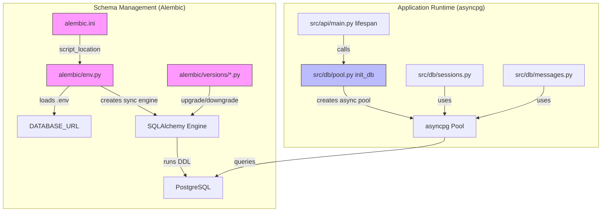
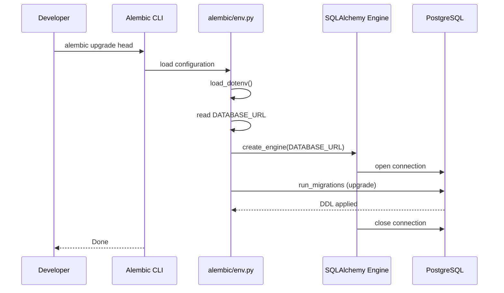
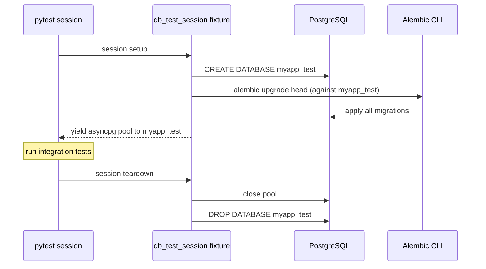

# Design Document: Database Migrations with Alembic

## Overview

This design introduces Alembic as the database migration framework for the research assistant project, replacing the inline DDL statements currently executed at application startup in `src/db/pool.py`.

The core change is a separation of concerns: **schema management** moves to Alembic migration scripts, while **connection pool management** stays in the existing `src/db/pool.py` module. SQLAlchemy is added solely as an Alembic dependency — the project continues to use asyncpg directly for all runtime queries.

### Key Design Decisions

1. **No SQLAlchemy ORM adoption**: SQLAlchemy is introduced only because Alembic requires it for its migration engine. Application code continues using raw asyncpg queries. There are no SQLAlchemy model classes.

2. **No autogenerate**: Since there are no SQLAlchemy ORM models to diff against, migrations are written manually using Alembic's `op.*` directives (`op.create_table`, `op.create_index`, etc.). This is explicit and avoids a metadata dependency.

3. **Synchronous migration execution**: Alembic runs migrations via a standard synchronous SQLAlchemy engine, completely independent of the application's async runtime. This is Alembic's default and most reliable mode.

4. **DATABASE_URL reuse**: Both the application and Alembic resolve the connection string from the same `DATABASE_URL` environment variable, loaded from `.env` via `python-dotenv`.

## Architecture



The two subsystems share only the database and the `DATABASE_URL` environment variable. They never share connections, engines, or runtime state.

### Migration Execution Flow



## Components and Interfaces

### New Files

| File | Purpose |
|------|---------|
| `alembic.ini` | Alembic configuration; references `alembic/` as script location; no hardcoded credentials |
| `alembic/env.py` | Migration environment; loads `.env`, resolves `DATABASE_URL`, configures sync SQLAlchemy engine |
| `alembic/script.py.mako` | Template for new migration scripts (Alembic default) |
| `alembic/versions/<rev>_initial_schema.py` | Initial migration capturing the current schema |
| `tests/conftest.py` (or `tests/integration/conftest.py`) | Session-scoped pytest fixture for test database lifecycle |

### Modified Files

| File | Change |
|------|--------|
| `src/db/pool.py` | Remove all DDL from `init_db()`; add schema drift checks; keep pool creation and public interface |
| `requirements.txt` | Add `alembic` and `sqlalchemy` with pinned versions |

### Unchanged Files

| File | Reason |
|------|--------|
| `src/db/sessions.py` | Query module — uses asyncpg pool, no DDL |
| `src/db/messages.py` | Query module — uses asyncpg pool, no DDL |
| `src/api/main.py` | Lifespan still calls `init_db()` and `close_pool()` — no change needed |
| `src/config/settings.py` | Pool config constants unchanged |

### alembic.ini

```ini
[alembic]
script_location = alembic
# sqlalchemy.url is intentionally omitted here.
# env.py reads DATABASE_URL from the environment at runtime.

[loggers]
keys = root,sqlalchemy,alembic

[handlers]
keys = console

[formatters]
keys = generic

[logger_root]
level = WARN
handlers = console

[logger_sqlalchemy]
level = WARN
handlers =
qualname = sqlalchemy.engine

[logger_alembic]
level = INFO
handlers =
qualname = alembic

[handler_console]
class = StreamHandler
args = (sys.stderr,)
level = NOTSET
formatter = generic

[formatter_generic]
format = %(levelname)-5.5s [%(name)s] %(message)s
datefmt = %H:%M:%S
```

### alembic/env.py

Key responsibilities:
1. Call `load_dotenv()` to load `.env` before anything else
2. Read `DATABASE_URL` from the environment; raise `RuntimeError` if missing
3. Override `sqlalchemy.url` in the Alembic config with the resolved URL
4. Provide `run_migrations_offline()` for `--sql` mode
5. Provide `run_migrations_online()` for normal execution with a sync `create_engine`

```python
from logging.config import fileConfig

from alembic import context
from dotenv import load_dotenv
from sqlalchemy import engine_from_config, pool

import os

# Load .env before resolving DATABASE_URL
load_dotenv()

config = context.config

if config.config_file_name is not None:
    fileConfig(config.config_file_name)

database_url = os.getenv("DATABASE_URL")
if not database_url:
    raise RuntimeError(
        "DATABASE_URL environment variable is not set. "
        "Please set it in your .env file or environment."
    )

config.set_main_option("sqlalchemy.url", database_url)

target_metadata = None  # No SQLAlchemy ORM models


def run_migrations_offline() -> None:
    url = config.get_main_option("sqlalchemy.url")
    context.configure(url=url, target_metadata=target_metadata, literal_binds=True)
    with context.begin_transaction():
        context.run_migrations()


def run_migrations_online() -> None:
    connectable = engine_from_config(
        config.get_section(config.config_ini_section, {}),
        prefix="sqlalchemy.",
        poolclass=pool.NullPool,
    )
    with connectable.connect() as connection:
        context.configure(connection=connection, target_metadata=target_metadata)
        with context.begin_transaction():
            context.run_migrations()


if context.is_offline_mode():
    run_migrations_offline()
else:
    run_migrations_online()
```

### Refactored src/db/pool.py

The `init_db()` function is stripped of all DDL. It creates the asyncpg pool, runs schema drift sanity checks, and returns the pool.

```python
import os

import asyncpg

from src.config.settings import DEFAULT_DB_POOL_MIN, DEFAULT_DB_POOL_MAX

_pool: asyncpg.Pool | None = None

_EXPECTED_TABLES = ("sessions", "messages")


def _get_database_url() -> str:
    database_url = os.getenv("DATABASE_URL")
    if not database_url:
        raise RuntimeError("DATABASE_URL is not set")
    return database_url


async def _check_schema(pool: asyncpg.Pool) -> None:
    """Verify that expected tables and Alembic version exist.

    Raises RuntimeError with actionable instructions if the schema
    is missing or migrations have not been applied.
    """
    async with pool.acquire() as conn:
        # Check for expected application tables
        rows = await conn.fetch(
            """
            SELECT tablename FROM pg_tables
            WHERE schemaname = 'public' AND tablename = ANY($1::text[])
            """,
            list(_EXPECTED_TABLES),
        )
        found = {row["tablename"] for row in rows}
        missing = set(_EXPECTED_TABLES) - found
        if missing:
            raise RuntimeError(
                f"Schema drift detected: missing tables {sorted(missing)}. "
                "Run `alembic upgrade head` before starting the application."
            )

        # Check that alembic_version exists and has a revision
        version_exists = await conn.fetchval(
            """
            SELECT EXISTS (
                SELECT 1 FROM pg_tables
                WHERE schemaname = 'public' AND tablename = 'alembic_version'
            )
            """
        )
        if not version_exists:
            raise RuntimeError(
                "Schema drift detected: alembic_version table not found. "
                "Run `alembic upgrade head` before starting the application."
            )

        revision = await conn.fetchval("SELECT version_num FROM alembic_version LIMIT 1")
        if not revision:
            raise RuntimeError(
                "Schema drift detected: alembic_version table is empty (no applied revisions). "
                "Run `alembic upgrade head` before starting the application."
            )


async def get_pool() -> asyncpg.Pool:
    """Return the existing pool, creating it if necessary."""
    global _pool
    if _pool is None:
        _pool = await asyncpg.create_pool(
            _get_database_url(),
            min_size=DEFAULT_DB_POOL_MIN,
            max_size=DEFAULT_DB_POOL_MAX,
        )
    return _pool


async def init_db() -> asyncpg.Pool:
    """Create the connection pool, verify schema, and return the pool.

    Schema management is handled by Alembic migrations.
    Run `alembic upgrade head` before starting the application.

    Raises RuntimeError if expected tables or Alembic version are missing.
    """
    pool = await get_pool()
    await _check_schema(pool)
    return pool


async def close_pool() -> None:
    """Close the connection pool gracefully."""
    global _pool
    if _pool is not None:
        await _pool.close()
        _pool = None
```

## Data Models

### Current Database Schema

The initial migration must reproduce this exact schema. The DDL is derived from the current `init_db()` in `src/db/pool.py`.

#### sessions table

| Column | Type | Constraints |
|--------|------|-------------|
| `id` | `UUID` | `PRIMARY KEY` |
| `header` | `TEXT` | nullable |
| `initial_prompt` | `TEXT` | `NOT NULL` |
| `report_markdown` | `TEXT` | nullable |
| `search_mode` | `TEXT` | `NOT NULL DEFAULT 'no_adaptive'` |
| `cost_effective_search` | `BOOLEAN` | `NOT NULL DEFAULT FALSE` |
| `created_at` | `TIMESTAMPTZ` | `NOT NULL DEFAULT NOW()` |
| `updated_at` | `TIMESTAMPTZ` | `NOT NULL DEFAULT NOW()` |
| `last_activity_at` | `TIMESTAMPTZ` | `NOT NULL DEFAULT NOW()` |
| `usage_jsonb` | `JSONB` | nullable |
| `cost_summary_jsonb` | `JSONB` | nullable |

**Index**: `idx_sessions_last_activity` on `sessions(last_activity_at DESC)`

#### messages table

| Column | Type | Constraints |
|--------|------|-------------|
| `id` | `UUID` | `PRIMARY KEY` |
| `session_id` | `UUID` | `NOT NULL REFERENCES sessions(id) ON DELETE CASCADE` |
| `role` | `TEXT` | `NOT NULL` |
| `content` | `TEXT` | `NOT NULL` |
| `message_type` | `TEXT` | `NOT NULL` |
| `agent_name` | `TEXT` | nullable |
| `usage_jsonb` | `JSONB` | nullable |
| `created_at` | `TIMESTAMPTZ` | `NOT NULL DEFAULT NOW()` |

**Index**: `idx_messages_session_id` on `messages(session_id)`

### Initial Migration Script

The migration uses Alembic's `op.*` directives with SQLAlchemy column types to express the schema declaratively:

```python
"""Initial schema: sessions and messages tables.

Revision ID: <auto-generated>
Revises:
Create Date: <auto-generated>
"""

from alembic import op
import sqlalchemy as sa
from sqlalchemy.dialects import postgresql

revision = "<auto-generated>"
down_revision = None
branch_labels = None
depends_on = None


def upgrade() -> None:
    op.create_table(
        "sessions",
        sa.Column("id", postgresql.UUID(as_uuid=True), primary_key=True),
        sa.Column("header", sa.Text(), nullable=True),
        sa.Column("initial_prompt", sa.Text(), nullable=False),
        sa.Column("report_markdown", sa.Text(), nullable=True),
        sa.Column(
            "search_mode",
            sa.Text(),
            nullable=False,
            server_default="no_adaptive",
        ),
        sa.Column(
            "cost_effective_search",
            sa.Boolean(),
            nullable=False,
            server_default=sa.text("false"),
        ),
        sa.Column(
            "created_at",
            sa.DateTime(timezone=True),
            nullable=False,
            server_default=sa.text("now()"),
        ),
        sa.Column(
            "updated_at",
            sa.DateTime(timezone=True),
            nullable=False,
            server_default=sa.text("now()"),
        ),
        sa.Column(
            "last_activity_at",
            sa.DateTime(timezone=True),
            nullable=False,
            server_default=sa.text("now()"),
        ),
        sa.Column("usage_jsonb", postgresql.JSONB(), nullable=True),
        sa.Column("cost_summary_jsonb", postgresql.JSONB(), nullable=True),
    )

    op.create_table(
        "messages",
        sa.Column("id", postgresql.UUID(as_uuid=True), primary_key=True),
        sa.Column(
            "session_id",
            postgresql.UUID(as_uuid=True),
            sa.ForeignKey("sessions.id", ondelete="CASCADE"),
            nullable=False,
        ),
        sa.Column("role", sa.Text(), nullable=False),
        sa.Column("content", sa.Text(), nullable=False),
        sa.Column("message_type", sa.Text(), nullable=False),
        sa.Column("agent_name", sa.Text(), nullable=True),
        sa.Column("usage_jsonb", postgresql.JSONB(), nullable=True),
        sa.Column(
            "created_at",
            sa.DateTime(timezone=True),
            nullable=False,
            server_default=sa.text("now()"),
        ),
    )

    op.create_index(
        "idx_sessions_last_activity",
        "sessions",
        [sa.text("last_activity_at DESC")],
    )
    op.create_index(
        "idx_messages_session_id",
        "messages",
        ["session_id"],
    )


def downgrade() -> None:
    # Drop in reverse order: indexes first, then tables respecting FK deps
    op.drop_index("idx_messages_session_id", table_name="messages")
    op.drop_index("idx_sessions_last_activity", table_name="sessions")
    op.drop_table("messages")  # Must drop before sessions (FK dependency)
    op.drop_table("sessions")
```

### Alembic Version Tracking

Alembic automatically creates and manages an `alembic_version` table in the database:

| Column | Type | Purpose |
|--------|------|---------|
| `version_num` | `VARCHAR(32)` | Currently applied migration revision hash |

This table is managed entirely by Alembic and should not be modified manually.

## Error Handling

### Missing DATABASE_URL

Both `env.py` and `pool.py` raise a `RuntimeError` with a clear message when `DATABASE_URL` is not set. The error messages are distinct to help identify which component failed:

- **env.py**: `"DATABASE_URL environment variable is not set. Please set it in your .env file or environment."`
- **pool.py**: `"DATABASE_URL is not set"` (existing behavior, unchanged)

### Migration Failures

Alembic wraps each migration in a transaction by default. If a migration fails mid-execution:
- The transaction is rolled back automatically
- The `alembic_version` table is not updated
- The database remains at the previous revision

No custom error handling is needed — Alembic's default transactional behavior is sufficient.

### Downgrade FK Ordering

The `downgrade()` function in the initial migration drops `messages` before `sessions` to respect the foreign key constraint. If this order were reversed, PostgreSQL would raise a dependency error. This ordering is enforced by the migration script itself, not by any runtime logic.

### Schema Drift Detection

After this change, the application assumes the schema is already in place when it starts. The `init_db()` function performs sanity checks after creating the connection pool to catch common developer mistakes early:

1. **Table existence check**: Queries `pg_tables` to verify that `sessions` and `messages` tables exist in the `public` schema.
2. **Alembic version check**: Verifies that the `alembic_version` table exists and contains at least one revision row.

If any check fails, `init_db()` raises a `RuntimeError` with a clear message instructing the developer to run `alembic upgrade head`. This replaces the previous behavior where missing tables would cause cryptic PostgreSQL errors (e.g., `relation "sessions" does not exist`) deep in query execution.

The checks use lightweight `pg_tables` catalog queries and a single `SELECT` on `alembic_version`, adding negligible startup overhead.

**Error messages by failure mode:**

| Condition | Error Message |
|-----------|---------------|
| `sessions` or `messages` table missing | `Schema drift detected: missing tables ['messages', 'sessions']. Run 'alembic upgrade head' before starting the application.` |
| `alembic_version` table missing | `Schema drift detected: alembic_version table not found. Run 'alembic upgrade head' before starting the application.` |
| `alembic_version` table empty | `Schema drift detected: alembic_version table is empty (no applied revisions). Run 'alembic upgrade head' before starting the application.` |

## Testing Strategy

### PBT Assessment

Property-based testing is **not appropriate** for this feature. The acceptance criteria involve:
- **File/directory existence checks** (Alembic project structure)
- **Configuration validation** (alembic.ini, env.py settings)
- **Deterministic DDL execution** (CREATE TABLE, DROP TABLE)
- **External CLI tool behavior** (alembic upgrade/downgrade/current/history)

None of these have a meaningful input space that varies — the DDL is fixed, the config is static, and the CLI commands are deterministic. Running any of these 100 times would not find more bugs than running them once. The Correctness Properties section is therefore omitted.

### Test Categories

#### Smoke Tests
Verify that the Alembic project structure and configuration are correct:
- `alembic/` directory contains `env.py`, `script.py.mako`, `versions/`
- `alembic.ini` exists and references `alembic/` as script location
- `alembic.ini` contains no hardcoded database credentials
- `requirements.txt` includes `alembic` and `sqlalchemy`
- `pool.py` public interface (`get_pool`, `init_db`, `close_pool`) is preserved

#### Example-Based Unit Tests
Verify specific behaviors with concrete scenarios:
- `env.py` loads `.env` via `python-dotenv` before resolving `DATABASE_URL`
- Missing `DATABASE_URL` raises `RuntimeError` with a clear message
- `init_db()` creates and returns an asyncpg pool without executing any DDL
- `init_db()` is still called during FastAPI lifespan startup
- `env.py` supports both offline (`--sql`) and online migration modes
- `_check_schema()` raises `RuntimeError` when `sessions` table is missing
- `_check_schema()` raises `RuntimeError` when `messages` table is missing
- `_check_schema()` raises `RuntimeError` when `alembic_version` table is missing
- `_check_schema()` raises `RuntimeError` when `alembic_version` table is empty
- `_check_schema()` passes when all expected tables and a revision exist
- Error messages include the instruction to run `alembic upgrade head`

#### Integration Tests (dedicated test database)
Integration tests run against an isolated temporary PostgreSQL database to avoid interfering with real application data.

**Test Database Lifecycle:**



**Test Database Fixture Design:**

A session-scoped pytest fixture manages the full lifecycle:

1. **Derive test DB name**: Parse `DATABASE_URL` and append `_test` to the database name (e.g., `research_assistant` → `research_assistant_test`).
2. **Create test database**: Connect to the default `postgres` maintenance database and execute `CREATE DATABASE <test_db_name>`.
3. **Run migrations**: Execute `alembic upgrade head` with the test database URL (using Alembic's `-x` argument or environment variable override).
4. **Provide connection pool**: Create an asyncpg pool connected to the test database and yield it to tests.
5. **Teardown**: Close the pool, then connect to `postgres` and execute `DROP DATABASE <test_db_name>`.

```python
import asyncio
import subprocess
from urllib.parse import urlparse, urlunparse

import asyncpg
import pytest


def _derive_test_db_url(database_url: str) -> tuple[str, str]:
    """Return (test_database_url, test_db_name) by appending _test to the DB name."""
    parsed = urlparse(database_url)
    test_db_name = parsed.path.lstrip("/") + "_test"
    test_url = urlunparse(parsed._replace(path=f"/{test_db_name}"))
    return test_url, test_db_name


def _maintenance_url(database_url: str) -> str:
    """Return a URL pointing at the 'postgres' maintenance database."""
    parsed = urlparse(database_url)
    return urlunparse(parsed._replace(path="/postgres"))


@pytest.fixture(scope="session")
def test_db(tmp_path_factory):
    """Create a temporary test database, run migrations, yield pool, then drop."""
    import os
    from dotenv import load_dotenv

    load_dotenv()
    database_url = os.environ["DATABASE_URL"]
    test_url, test_db_name = _derive_test_db_url(database_url)
    maint_url = _maintenance_url(database_url)

    async def _setup():
        # Create the test database
        conn = await asyncpg.connect(maint_url)
        try:
            await conn.execute(f'DROP DATABASE IF EXISTS "{test_db_name}"')
            await conn.execute(f'CREATE DATABASE "{test_db_name}"')
        finally:
            await conn.close()

        # Run Alembic migrations against the test database
        env = {**os.environ, "DATABASE_URL": test_url}
        subprocess.run(
            ["alembic", "upgrade", "head"],
            env=env,
            check=True,
            capture_output=True,
        )

        # Create and return a pool to the test database
        pool = await asyncpg.create_pool(test_url, min_size=1, max_size=3)
        return pool

    async def _teardown(pool):
        await pool.close()
        conn = await asyncpg.connect(maint_url)
        try:
            # Terminate other connections before dropping
            await conn.execute(f"""
                SELECT pg_terminate_backend(pid)
                FROM pg_stat_activity
                WHERE datname = '{test_db_name}' AND pid <> pg_backend_pid()
            """)
            await conn.execute(f'DROP DATABASE IF EXISTS "{test_db_name}"')
        finally:
            await conn.close()

    loop = asyncio.get_event_loop_policy().new_event_loop()
    pool = loop.run_until_complete(_setup())
    yield pool
    loop.run_until_complete(_teardown(pool))
    loop.close()
```

**Integration test scenarios** (all run against the test database):
- `alembic upgrade head` creates `sessions` and `messages` tables with correct columns, types, defaults, and constraints
- `alembic upgrade head` creates both indexes (`idx_sessions_last_activity`, `idx_messages_session_id`)
- Schema produced by `alembic upgrade head` matches the schema previously produced by `init_db()` inline DDL
- `alembic downgrade -1` removes all application tables and indexes
- Downgrade-then-upgrade round trip produces a schema identical to upgrade alone
- `alembic current`, `alembic history`, and `alembic revision` CLI commands work correctly
- `_check_schema()` passes against a fully migrated test database
- `_check_schema()` fails against an empty test database (before migrations)

### Test Framework

- **pytest** (existing) for all test types
- **hypothesis** is already in the project but not used for this feature (no PBT)
- Integration tests use a **dedicated test database** (session-scoped fixture) — never the main application database
- Integration tests should be marked with `@pytest.mark.integration` and skipped when no database is available
- Unit tests mock `asyncpg.create_pool`, `asyncpg.Pool`, and environment variables as needed
- Schema drift unit tests mock `pool.acquire()` and the underlying `pg_tables` / `alembic_version` queries
