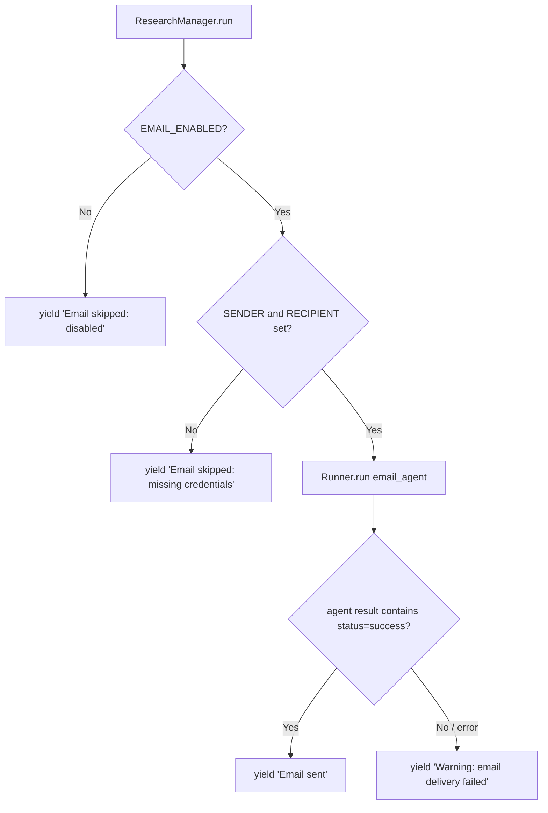

# Design Document: Email Delivery Fix

## Overview

Email delivery is currently unconditional — the `send_email()` pipeline step always runs, and a hardcoded `print("Email sent")` fires regardless of whether the SES tool actually succeeded. This fix introduces an explicit opt-in gate (`EMAIL_ENABLED`), short-circuits the email step when the feature is disabled or credentials are missing, and surfaces real delivery outcomes to the SSE stream instead of printing blindly.

No new classes or architectural changes are required. The fix touches three lines of config and one method in `ResearchManager`.

---

## Architecture

The email path sits at the tail end of the `ResearchManager.run()` async generator. The change inserts a guard before the agent is invoked and replaces the unconditional success print with result-aware SSE yields.



---

## Components and Interfaces

### 1. `src/config/settings.py` — new constant

**Change**: Add `EMAIL_ENABLED` below the existing `SENDER`/`RECIPIENT` lines.

```python
# E-mail config
RECIPIENT = os.getenv("EMAIL_RECIPIENT", "")
SENDER = os.getenv("EMAIL_SENDER", "")
EMAIL_ENABLED = os.getenv("EMAIL_ENABLED", "false").lower() == "true"
DEFAULT_AWS_REGION = "eu-north-1"
```

**Defaults**:

| Variable | Env var | Default | Meaning |
|---|---|---|---|
| `SENDER` | `EMAIL_SENDER` | `""` | SES verified sender address |
| `RECIPIENT` | `EMAIL_RECIPIENT` | `""` | Delivery address |
| `EMAIL_ENABLED` | `EMAIL_ENABLED` | `False` | Feature off unless explicitly opted in |

---

### 2. `src/core/research_manager.py` — `send_email()` guard and result handling

**Current behaviour** (problematic):

```python
async def send_email(self, report: FinalReportData) -> None:
    print("Writing email...")
    result = await Runner.run(email_agent, report.markdown_report)
    self.update_usage_stats("email_agent", result.context_wrapper.usage)
    print("Email sent")          # fires even on SES error
    print(f"Total cost: {self.calculate_total_cost()}")
```

**Target behaviour**:

```python
async def send_email(self, report: FinalReportData) -> str:
    """
    Attempt to send the final report via email.

    Returns a single SSE-ready status string for the caller to yield.
    Skips silently (with a descriptive message) when EMAIL_ENABLED is False
    or when SENDER / RECIPIENT are not configured.
    """
    from src.config.settings import EMAIL_ENABLED, RECIPIENT, SENDER

    if not EMAIL_ENABLED:
        return "Email skipped: EMAIL_ENABLED is not set.\n"

    if not SENDER or not RECIPIENT:
        return "Email skipped: SENDER or RECIPIENT not configured.\n"

    print("Writing email...")
    result = await Runner.run(email_agent, report.markdown_report)
    self.update_usage_stats("email_agent", result.context_wrapper.usage)
    print(f"Total cost: {self.calculate_total_cost()}")

    # Inspect the agent's final output for the tool result status
    output_text = str(result.final_output)
    if "status" in output_text and "error" in output_text.lower():
        return "Warning: email delivery failed — check SES configuration.\n"

    return "Email sent.\n"
```

The caller in `run()` changes from:

```python
yield "Sending email...\n"
await self.send_email(final_report)
```

to:

```python
yield "Sending email...\n"
status = await self.send_email(final_report)
yield status
```

---

### 3. `src/agents/email_agent.py` — no changes

The `send_email` function tool already guards against empty `SENDER`/`RECIPIENT` and returns `{"status": "error", ...}` in that case. That logic is correct and stays as-is.

---

## Data Models

No new Pydantic models are needed. The only data flowing through the changed path is:

- `EMAIL_ENABLED: bool` — module-level constant in `settings.py`
- `SENDER: str`, `RECIPIENT: str` — existing constants, unchanged
- Return value of `ResearchManager.send_email()` changes from `None` to `str` (an SSE-ready message)

---

## Error Handling

| Scenario | Current behaviour | Fixed behaviour |
|---|---|---|
| `EMAIL_ENABLED=false` (default) | Agent runs, SES call attempted | Method returns early; SSE yields skip message |
| `SENDER` or `RECIPIENT` empty | Agent runs, tool returns `{"status":"error"}`, `print("Email sent")` fires | Method returns early; SSE yields skip message |
| SES call fails at runtime | `print("Email sent")` fires anyway | SSE yields warning message |
| SES call succeeds | `print("Email sent")` fires | SSE yields `"Email sent.\n"` |

---

## Testing Strategy

### Unit Tests

- `test_send_email_skipped_when_disabled`: patch `EMAIL_ENABLED=False`, assert `send_email()` returns the skip string and `Runner.run` is never called.
- `test_send_email_skipped_when_no_credentials`: patch `EMAIL_ENABLED=True`, `SENDER=""`, assert early return and no agent call.
- `test_send_email_success`: patch `EMAIL_ENABLED=True`, valid credentials, mock `Runner.run` returning output without "error", assert return value is `"Email sent.\n"`.
- `test_send_email_failure_surfaced`: mock `Runner.run` returning output containing `"status": "error"`, assert return value contains `"Warning"`.

### Integration / SSE Tests

Verify that the string returned by `send_email()` is actually yielded into the SSE stream by `run()` — i.e., the `yield status` line is exercised.

### Property-Based Testing

Not applicable for this fix — the logic is purely conditional with no complex data transformations.

---

## Security Considerations

- `EMAIL_ENABLED` defaults to `False`, which is the safe default: no credentials are required and no outbound SES calls are made unless the operator explicitly opts in.
- `SENDER` and `RECIPIENT` are read from environment variables; they are never logged or included in SSE output.

---

## Dependencies

No new dependencies. The fix uses only existing imports (`os`, `src.config.settings`, `src.agents.email_agent`).

---

## Correctness Properties

*A property is a characteristic or behavior that should hold true across all valid executions of a system — essentially, a formal statement about what the system should do. Properties serve as the bridge between human-readable specifications and machine-verifiable correctness guarantees.*

### Property 1: EMAIL_ENABLED is False for any non-"true" env var value

*For any* string value of the `EMAIL_ENABLED` environment variable that is not equal to `"true"` (case-insensitive), the `EMAIL_ENABLED` constant in Settings SHALL evaluate to `False`.

**Validates: Requirements 1.2**

### Property 2: send_email always returns a str

*For any* call to `ResearchManager.send_email()` — regardless of the values of `EMAIL_ENABLED`, `SENDER`, `RECIPIENT`, or the agent output — the return value SHALL be of type `str` and SHALL be non-empty.

**Validates: Requirements 4.3**

### Property 3: Email_Agent is never called when EMAIL_ENABLED is False

*For any* `FinalReportData` value, when `EMAIL_ENABLED` is `False`, calling `ResearchManager.send_email()` SHALL NOT invoke `Runner.run` with the Email_Agent.

**Validates: Requirements 2.1, 2.3**

### Property 4: Email_Agent is never called when credentials are missing

*For any* `FinalReportData` value and any combination of empty `SENDER` or empty `RECIPIENT` (with `EMAIL_ENABLED=True`), calling `ResearchManager.send_email()` SHALL NOT invoke `Runner.run` with the Email_Agent.

**Validates: Requirements 3.1, 3.2, 3.4**

### Property 5: Agent output containing "error" produces a warning return value

*For any* agent output string that contains the substring `"error"` (case-insensitive), `ResearchManager.send_email()` SHALL return a string containing `"Warning"`.

**Validates: Requirements 4.2**

### Property 6: Agent output not containing "error" produces the success return value

*For any* agent output string that does not contain the substring `"error"` (case-insensitive), `ResearchManager.send_email()` SHALL return `"Email sent.\n"`.

**Validates: Requirements 4.1**
