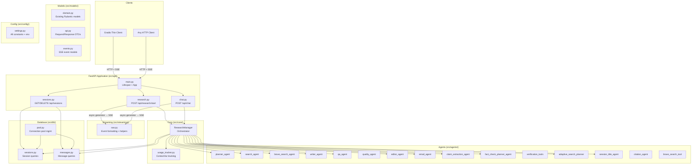
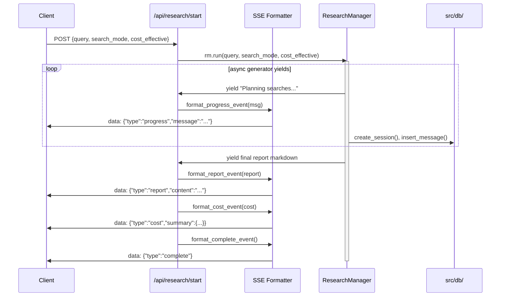
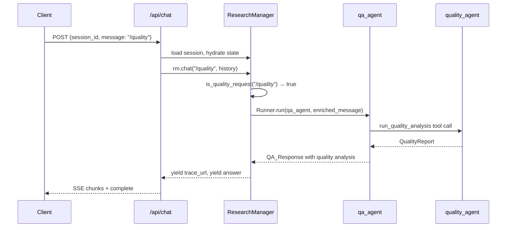
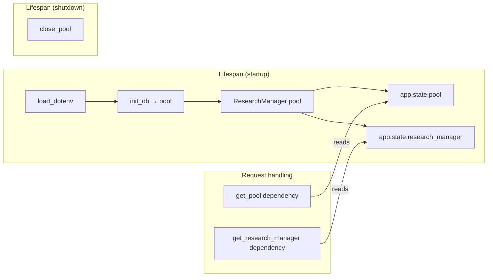

# Design Document: FastAPI Backend Refactor

## Overview

This design describes the refactoring of a monolithic Gradio-coupled research assistant into a layered FastAPI backend. The core goal is to extract a clean HTTP API that exposes the existing research pipeline, Q&A chat, session management, and cost tracking capabilities via REST endpoints with Server-Sent Events (SSE) for streaming long-running operations.

The refactoring is purely structural — no agent logic, prompt text, or model configurations change. The `ResearchManager` orchestrator is decoupled from Gradio by removing its inline database operations and accepting dependencies explicitly. A new `src/` package tree provides clear module boundaries: API routes, core orchestration, agents, models, database, streaming, and configuration.

Key design decisions:
- **SSE over WebSockets**: SSE is a natural fit because the research pipeline and chat flows are unidirectional server-to-client streams. The existing async generator contract (`yield` strings) maps directly to SSE events.
- **sse-starlette**: The `EventSourceResponse` from `sse-starlette` is used for SSE streaming — it handles ping keepalives, client disconnect detection, and conforms to the SSE spec out of the box.
- **Dependency injection via FastAPI lifespan**: The database pool and `ResearchManager` instance are initialized in a lifespan context manager and stored in `app.state`, avoiding module-level global singletons.
- **Database layer extraction**: Inline SQL in `ResearchManager` is extracted into standalone async functions in `src/db/` that accept a pool parameter, making them testable and reusable.

## Architecture

### High-Level Component Diagram



### Request Flow: Research Pipeline



## Components and Interfaces

### Package Structure (file-by-file)

```
src/
├── __init__.py
├── api/
│   ├── __init__.py
│   ├── main.py              # FastAPI app, lifespan, router registration
│   ├── research.py           # POST /api/research/start (SSE)
│   ├── chat.py               # POST /api/chat (SSE)
│   ├── sessions.py           # GET/DELETE /api/sessions, GET /api/sessions/{id}, GET /api/sessions/{id}/cost
│   └── dependencies.py       # Shared FastAPI dependencies (get_pool, get_research_manager)
├── core/
│   ├── __init__.py
│   ├── research_manager.py   # ResearchManager (no DB imports, accepts pool)
│   └── usage_tracker.py      # ContextVar-based usage tracking (unchanged logic)
├── agents/
│   ├── __init__.py
│   ├── planner_agent.py
│   ├── search_agent.py
│   ├── brave_search_agent.py
│   ├── brave_search_tool.py
│   ├── writer_agent.py
│   ├── editor_agent.py
│   ├── qa_agent.py
│   ├── quality_agent.py
│   ├── claim_extraction_agent.py
│   ├── fact_check_planner_agent.py
│   ├── verification_tools.py
│   ├── email_agent.py
│   ├── session_title_agent.py
│   ├── adaptive_search_planner.py
│   └── citation_agent.py
├── models/
│   ├── __init__.py
│   ├── domain.py             # Existing models from new_models.py (unchanged)
│   └── api.py                # Request/Response DTOs + SSE event models
├── db/
│   ├── __init__.py
│   ├── pool.py               # init_db(), get_pool(), close_pool()
│   ├── sessions.py           # create_session(), update_session(), list_sessions(), load_session(), delete_session()
│   └── messages.py           # insert_message(), fetch_chat_messages()
├── streaming/
│   ├── __init__.py
│   └── sse.py                # SSE event formatting, async generator → EventSourceResponse adapter
└── config/
    ├── __init__.py
    └── settings.py           # All constants from config.py + env loading
```

### Component Interfaces

#### `src/api/main.py` — Application Bootstrap

```python
from contextlib import asynccontextmanager
from fastapi import FastAPI
from dotenv import load_dotenv

@asynccontextmanager
async def lifespan(app: FastAPI):
    load_dotenv(override=True)
    pool = await init_db()
    app.state.pool = pool
    app.state.research_manager = ResearchManager(pool=pool)
    yield
    await close_pool()

app = FastAPI(title="Deep Research API", lifespan=lifespan)
app.include_router(research_router, prefix="/api")
app.include_router(chat_router, prefix="/api")
app.include_router(sessions_router, prefix="/api")
```

#### `src/api/dependencies.py` — Shared Dependencies

```python
from fastapi import Request
import asyncpg

def get_pool(request: Request) -> asyncpg.Pool:
    return request.app.state.pool

def get_research_manager(request: Request) -> ResearchManager:
    return request.app.state.research_manager
```

#### `src/core/research_manager.py` — Refactored Orchestrator

Key changes from current `research_manager.py`:
1. Constructor accepts `pool: asyncpg.Pool` instead of calling `init_db()` internally
2. All inline SQL replaced with calls to `src.db.sessions` and `src.db.messages` functions
3. No Gradio imports
4. `run()` and `chat()` remain async generators yielding strings — the API layer translates these to SSE events

```python
class ResearchManager:
    def __init__(self, pool: asyncpg.Pool):
        self.pool = pool
        self.report: FinalReportData | None = None
        self.search_results: list[str] = []
        self.last_query: str | None = None
        self.session_usage = SessionUsage()
        self.current_session_id: uuid.UUID | None = None
        # ... same state fields

    async def run(self, query: str, search_mode: str = "no_adaptive",
                  cost_effective: bool = False):
        """Async generator yielding progress strings, then final report."""
        # Same pipeline logic, but DB calls go through:
        #   await db_sessions.create_session(self.pool, ...)
        #   await db_messages.insert_message(self.pool, ...)
        #   await db_sessions.update_session(self.pool, ...)
        ...

    async def chat(self, message: str, history: list[tuple[str, str]]):
        """Async generator yielding trace URL then answer chunks."""
        ...
```

#### `src/db/pool.py` — Connection Pool Management

```python
import asyncpg

_pool: asyncpg.Pool | None = None

async def init_db() -> asyncpg.Pool:
    """Create pool, run CREATE TABLE IF NOT EXISTS, return pool."""
    ...

async def get_pool() -> asyncpg.Pool:
    """Return existing pool or create one."""
    ...

async def close_pool() -> None:
    """Close the pool gracefully."""
    ...
```

#### `src/db/sessions.py` — Session Queries

All functions accept `pool: asyncpg.Pool` as first parameter:

```python
async def create_session(pool, session_id, initial_prompt, search_mode, cost_effective, usage, cost) -> None
async def update_session(pool, session_id, header=None, report_markdown=None, search_mode=None, usage=None, cost=None) -> None
async def list_sessions(pool) -> list[dict]
async def load_session(pool, session_id: uuid.UUID) -> dict | None
async def delete_session(pool, session_id: uuid.UUID) -> bool
```

#### `src/db/messages.py` — Message Queries

```python
async def insert_message(pool, message_id, session_id, role, content, message_type, agent_name=None, usage=None) -> None
async def fetch_chat_messages(pool, session_id: uuid.UUID) -> list[dict]
```

#### `src/streaming/sse.py` — SSE Event Formatting

```python
import json
from sse_starlette import EventSourceResponse
from starlette.requests import Request

def format_event(event_type: str, **payload) -> str:
    """Format a JSON SSE event: {"type": event_type, ...payload}"""
    return json.dumps({"type": event_type, **payload})

def format_progress(message: str) -> str:
    return format_event("progress", message=message)

def format_report(content: str) -> str:
    return format_event("report", content=content)

def format_cost(summary: dict) -> str:
    return format_event("cost", summary=summary)

def format_chunk(content: str) -> str:
    return format_event("chunk", content=content)

def format_error(message: str) -> str:
    return format_event("error", message=message)

def format_complete() -> str:
    return format_event("complete")

async def research_event_stream(request: Request, rm: ResearchManager, query, search_mode, cost_effective):
    """Wrap ResearchManager.run() as an SSE event stream."""
    try:
        report_content = None
        async for chunk in rm.run(query, search_mode, cost_effective):
            if await request.is_disconnected():
                break
            if chunk.startswith("\n---\n## Final Report"):
                report_content = chunk.replace("\n---\n## Final Report\n\n", "")
                yield format_report(report_content)
            elif chunk.strip() == "Research complete!":
                yield format_cost(rm._cost_summary_snapshot())
                yield format_complete()
            else:
                yield format_progress(chunk.strip())
    except Exception as e:
        yield format_error(str(e))

def create_sse_response(generator, request: Request) -> EventSourceResponse:
    return EventSourceResponse(generator, ping=15)
```

#### `src/api/research.py` — Research Endpoint

```python
from fastapi import APIRouter, Depends, Request
from sse_starlette import EventSourceResponse

router = APIRouter()

@router.post("/research/start")
async def start_research(
    body: ResearchStartRequest,
    request: Request,
    rm: ResearchManager = Depends(get_research_manager),
):
    return EventSourceResponse(
        research_event_stream(request, rm, body.query, body.search_mode, body.cost_effective),
        ping=15,
    )
```

#### `src/api/chat.py` — Chat Endpoint

```python
@router.post("/chat")
async def chat(
    body: ChatRequest,
    request: Request,
    rm: ResearchManager = Depends(get_research_manager),
    pool: asyncpg.Pool = Depends(get_pool),
):
    session = await db_sessions.load_session(pool, body.session_id)
    if session is None:
        raise HTTPException(404, "Session not found")
    # Hydrate RM state from session, then stream
    return EventSourceResponse(
        chat_event_stream(request, rm, body.message, body.history),
        ping=15,
    )
```

#### `src/api/sessions.py` — Session Management

```python
@router.get("/sessions")
async def list_sessions(pool = Depends(get_pool)) -> list[SessionSummary]: ...

@router.get("/sessions/{session_id}")
async def get_session(session_id: UUID, pool = Depends(get_pool)) -> SessionDetail: ...

@router.delete("/sessions/{session_id}", status_code=204)
async def delete_session(session_id: UUID, pool = Depends(get_pool)): ...

@router.get("/sessions/{session_id}/cost")
async def get_cost(session_id: UUID, pool = Depends(get_pool)) -> CostSummary: ...
```


## Data Models

### Existing Domain Models (relocated to `src/models/domain.py`)

All models from `new_models.py` are moved as-is:

| Model | Purpose |
|-------|---------|
| `AgentUsage` | Per-agent token + tool call counters |
| `SessionUsage` | Aggregated usage across all agents |
| `WebSearchItem` / `WebSearchPlan` | Search planning |
| `SearchPhasePlan` / `AdaptiveSearchPlan` | Adaptive search phases |
| `WriterOutput` | Report generation output |
| `SingleClaimCitation` | Individual claim verification result |
| `ExtractedClaim` / `ExtractedClaims` | Claim extraction from reports |
| `FactCheckingResult` | Aggregated fact-check results |
| `VerifiedClaims` | Collection of verified claims |
| `QualityReport` | Quality/bias analysis output |
| `EditedReport` | Post-fact-check edited report |
| `FinalReportData` | Complete report with all metadata |

### New API DTOs (in `src/models/api.py`)

```python
from datetime import datetime
from uuid import UUID
from pydantic import BaseModel, Field
from typing import Optional

# --- Requests ---

class ResearchStartRequest(BaseModel):
    query: str = Field(..., min_length=1, description="Research query")
    search_mode: str = Field(
        default="no_adaptive",
        description="Search mode",
        pattern="^(no_adaptive|deep_dive|deep_dive_gap_fill)$",
    )
    cost_effective: bool = Field(default=False, description="Use Brave search for cost savings")

class ChatMessage(BaseModel):
    role: str = Field(..., pattern="^(user|assistant)$")
    content: str

class ChatRequest(BaseModel):
    session_id: UUID
    message: str = Field(..., min_length=1)
    history: list[ChatMessage] = Field(default_factory=list)

# --- Responses ---

class SessionSummary(BaseModel):
    id: UUID
    header: Optional[str] = None
    initial_prompt: str
    created_at: datetime

class CostSummary(BaseModel):
    total_input_tokens: int = 0
    total_output_tokens: int = 0
    total_tool_calls: int = 0
    total_cost: float = 0.0

class SessionDetail(BaseModel):
    id: UUID
    header: Optional[str] = None
    initial_prompt: str
    report_markdown: Optional[str] = None
    cost_summary: CostSummary
    chat_history: list[ChatMessage] = Field(default_factory=list)
    search_mode: str = "no_adaptive"
    cost_effective: bool = False

# --- SSE Events ---

class SSEEvent(BaseModel):
    type: str  # "progress" | "report" | "cost" | "chunk" | "error" | "complete"

class ProgressEvent(SSEEvent):
    type: str = "progress"
    message: str

class ReportEvent(SSEEvent):
    type: str = "report"
    content: str

class CostEvent(SSEEvent):
    type: str = "cost"
    summary: CostSummary

class ChunkEvent(SSEEvent):
    type: str = "chunk"
    content: str

class ErrorEvent(SSEEvent):
    type: str = "error"
    message: str

class CompleteEvent(SSEEvent):
    type: str = "complete"
```

### SSE Event Protocol Detail

Each SSE event is sent as a single `data:` line containing a JSON object, followed by a blank line:

```
data: {"type": "progress", "message": "Planning searches..."}

data: {"type": "progress", "message": "Executing searches..."}

data: {"type": "progress", "message": "Writing initial report..."}

data: {"type": "progress", "message": "Fact-checking report..."}

data: {"type": "report", "content": "# Research Report\n\n...full markdown..."}

data: {"type": "cost", "summary": {"total_input_tokens": 15234, "total_output_tokens": 8921, "total_tool_calls": 12, "total_cost": 0.0847}}

data: {"type": "complete"}
```

For chat streaming:
```
data: {"type": "chunk", "content": "View trace: https://platform.openai.com/traces/..."}

data: {"type": "chunk", "content": "Based on the report, the key findings are..."}

data: {"type": "complete"}
```

Error case:
```
data: {"type": "error", "message": "Research pipeline failed: API rate limit exceeded"}
```

### Database Layer Design

#### `src/db/pool.py`

Manages the asyncpg connection pool lifecycle. The `init_db()` function creates the pool and runs all `CREATE TABLE IF NOT EXISTS` and `ALTER TABLE` statements (same DDL as current `db.py`). The pool is stored in `app.state` via the lifespan, not as a module-level global.

#### `src/db/sessions.py` — Function Signatures

```python
async def create_session(
    pool: asyncpg.Pool,
    session_id: uuid.UUID,
    initial_prompt: str,
    search_mode: str,
    cost_effective_search: bool,
    usage_json: str,
    cost_json: str,
) -> None

async def update_session(
    pool: asyncpg.Pool,
    session_id: uuid.UUID,
    header: str | None = None,
    report_markdown: str | None = None,
    search_mode: str | None = None,
    usage_json: str | None = None,
    cost_json: str | None = None,
) -> None

async def list_sessions(pool: asyncpg.Pool) -> list[dict]:
    """Returns list of {id, header, initial_prompt, created_at}."""

async def load_session(pool: asyncpg.Pool, session_id: uuid.UUID) -> dict | None:
    """Returns full session row as dict, or None if not found."""

async def delete_session(pool: asyncpg.Pool, session_id: uuid.UUID) -> bool:
    """Deletes session + cascaded messages. Returns True if row existed."""
```

#### `src/db/messages.py` — Function Signatures

```python
async def insert_message(
    pool: asyncpg.Pool,
    message_id: uuid.UUID,
    session_id: uuid.UUID,
    role: str,
    content: str,
    message_type: str,
    agent_name: str | None = None,
    usage_json: str | None = None,
) -> None

async def fetch_chat_messages(
    pool: asyncpg.Pool,
    session_id: uuid.UUID,
) -> list[dict]:
    """Returns list of {role, content} for message_type='chat', ordered by created_at."""
```

### ResearchManager Refactoring Approach

The refactoring follows a method-extraction pattern:

1. **Constructor change**: Accept `pool: asyncpg.Pool` parameter. Remove `_get_pool()` method that called `init_db()`.

2. **Extract DB calls**: Every method that currently contains inline SQL (`_create_session`, `_update_session`, `_insert_message`, `list_sessions`, `load_session`) is replaced with a call to the corresponding `src.db` function, passing `self.pool`.

3. **Preserve generator contract**: `run()` and `chat()` remain async generators yielding strings. The API layer is responsible for parsing these yields and converting them to typed SSE events.

4. **Yield protocol for `run()`**: The existing yield pattern is preserved:
   - Progress strings (e.g., `"Planning searches...\n"`)
   - Final report prefixed with `"\n---\n## Final Report\n\n"`
   - `"Research complete!\n"` as the terminal yield

5. **State management**: `ResearchManager` remains stateful (holds current session's report, search results, usage). The FastAPI app holds a single instance in `app.state`. For concurrent research requests, the current singleton pattern means requests are serialized — this matches the existing Gradio behavior where one research run happens at a time. Future work could introduce per-session manager instances.

### Data Flow: Chat with Quality Analysis



### Dependency Injection and Lifecycle



The lifespan context manager ensures:
- Pool is created and tables exist before any request is served
- `ResearchManager` has a valid pool reference from the start
- Pool is closed cleanly on shutdown (SIGTERM, Ctrl+C)
- No module-level global singletons for the pool — it lives in `app.state`

FastAPI dependencies (`get_pool`, `get_research_manager`) read from `request.app.state`, making them easy to override in tests.


## Correctness Properties

*A property is a characteristic or behavior that should hold true across all valid executions of a system — essentially, a formal statement about what the system should do. Properties serve as the bridge between human-readable specifications and machine-verifiable correctness guarantees.*

### Property 1: SSE event formatting round-trip

*For any* event type in `{"progress", "report", "cost", "chunk", "error", "complete"}` and *for any* payload string or dict, calling the corresponding `format_*()` function SHALL produce a valid JSON string that, when parsed, contains a `type` field matching the event type and a payload field (`message`, `content`, or `summary`) whose value equals the original input. The `format_complete()` function SHALL produce JSON with only the `type` field and no additional keys.

**Validates: Requirements 4.6, 8.5, 9.1, 9.2, 9.3, 9.4, 9.5, 9.6, 9.7**

### Property 2: Request DTO validation accepts valid inputs and rejects invalid inputs

*For any* `ResearchStartRequest` constructed with a non-empty `query` string, a `search_mode` value in `{"no_adaptive", "deep_dive", "deep_dive_gap_fill"}`, and a boolean `cost_effective`, the model SHALL accept the input without raising a validation error. *For any* input where `query` is empty, `search_mode` is not in the allowed set, or required fields are missing, the model SHALL raise a `ValidationError`. The same property holds for `ChatRequest`: valid UUID `session_id`, non-empty `message`, and optional list of `ChatMessage` objects with role in `{"user", "assistant"}` SHALL be accepted; missing required fields or invalid UUIDs SHALL be rejected.

**Validates: Requirements 10.1, 10.2, 10.6**

### Property 3: Invalid request bodies produce HTTP 422

*For any* POST request to `/api/research/start` or `/api/chat` whose JSON body fails Pydantic validation (missing required fields, wrong types, invalid enum values), the API SHALL return HTTP status code 422 with a JSON body containing validation error details.

**Validates: Requirements 4.7, 10.6**

## Error Handling

### API Layer Errors

| Scenario | HTTP Status | Response |
|----------|-------------|----------|
| Invalid request body (missing fields, wrong types) | 422 | FastAPI default validation error JSON |
| Session not found (GET/DELETE/cost) | 404 | `{"detail": "Session not found"}` |
| No report for chat session | 404 | `{"detail": "No report available for this session"}` |
| Research pipeline exception | SSE error event | `{"type": "error", "message": "..."}` then stream closes |
| Chat pipeline exception | SSE error event | `{"type": "error", "message": "..."}` then stream closes |
| Database connection failure | 500 | `{"detail": "Internal server error"}` |
| Client disconnects during SSE | N/A | Generator cleanup via `request.is_disconnected()` |

### SSE Error Events

When an exception occurs inside the research or chat async generators, the SSE adapter catches it and emits a final error event before closing the stream:

```python
try:
    async for chunk in rm.run(...):
        yield format_progress(chunk)
except Exception as e:
    yield format_error(str(e))
```

### ResearchManager Error Handling

The existing error handling patterns are preserved:
- Agent `Runner.run()` exceptions bubble up from the async generator
- Individual search failures return `None` and are filtered out (existing `_search_with_routing` behavior)
- Fact-check verification failures produce low-confidence placeholders (existing `verification_tools.py` behavior)
- Email failures are logged but don't abort the pipeline

### Database Error Handling

- `asyncpg` exceptions from pool operations propagate to the API layer
- The API layer catches database errors and returns 500 responses
- Connection pool exhaustion is handled by asyncpg's built-in queue/timeout

## Testing Strategy

### Unit Tests

Unit tests cover pure functions and model validation without external dependencies:

- **SSE event formatting** (`src/streaming/sse.py`): Test each `format_*()` function with various inputs. Verify JSON validity, correct `type` field, correct payload field name and value.
- **Request/Response DTOs** (`src/models/api.py`): Test Pydantic model validation — valid inputs accepted, invalid inputs rejected with appropriate errors.
- **Cost calculation** (`ResearchManager.calculate_total_cost()`): Test with known usage data and verify cost computation.
- **Quality request detection** (`is_quality_request()`): Test with known commands and non-commands.

### Property-Based Tests

Property-based testing is appropriate for this feature because the SSE formatting functions are pure functions with clear input/output behavior, and the DTO validation has a large input space where random generation reveals edge cases.

- **Library**: `hypothesis` (Python PBT library)
- **Minimum iterations**: 100 per property
- **Tag format**: `Feature: fastapi-backend-refactor, Property {N}: {title}`

Property tests to implement:
1. **SSE event formatting round-trip** (Property 1): Generate random strings/dicts, format as SSE events, parse JSON, verify structure.
2. **DTO validation** (Property 2): Generate random valid and invalid request payloads using Hypothesis strategies, verify acceptance/rejection.
3. **Invalid request rejection** (Property 3): Generate invalid request bodies, POST to test client, verify 422 status.

### Integration Tests

Integration tests verify the full request/response cycle with a test database:

- **App startup/shutdown**: Verify lifespan initializes pool and creates tables, shutdown closes pool.
- **Research endpoint**: Mock `ResearchManager.run()` to yield known strings, verify SSE event sequence.
- **Chat endpoint**: Mock `ResearchManager.chat()`, verify chunk events and complete event.
- **Session CRUD**: Create, list, load, delete sessions via API endpoints against a test PostgreSQL instance.
- **404 handling**: Request non-existent sessions, verify 404 responses.

### Smoke Tests

Smoke tests verify structural correctness after the refactoring:

- All `__init__.py` files exist
- All agent modules importable from `src.agents.*`
- `src.api.main:app` is a valid FastAPI instance
- No `gradio` imports in `src/core/` or `src/db/`
- Database functions don't import from `src.core` or `src.agents`
