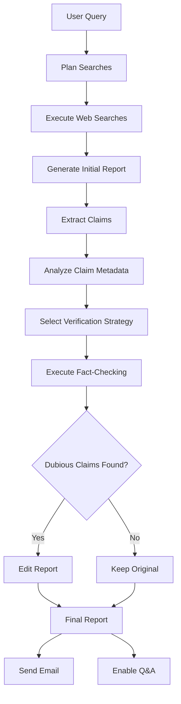

# Deep Research Agent

An intelligent research assistant built with OpenAI's Agents SDK that conducts comprehensive research, generates detailed reports, and provides fact-checking with intelligent verification strategies. The application features Q&A capabilities on generated reports and adaptive fact-checking with cost optimization.

## Features

- **Automated Research**: Multi-step web search planning and execution
- **Intelligent Report Generation**: Comprehensive markdown reports (1000+ words)
- **Advanced Fact-Checking**: Adaptive verification strategies with confidence scoring
- **Report Editing**: Automatic correction of dubious claims based on fact-checking results
- **Interactive Q&A**: Chat interface for querying report findings
- **Cost Optimization**: Smart verification strategies to balance accuracy and efficiency
- **Email Integration**: Automated report distribution

## Architecture

### Core Components

#### 1. Research Manager (`research_manager.py`)

The central orchestrator that manages the entire research pipeline:

```
Query → Plan Searches → Execute Searches → Write Report → Fact-Check → Edit (if needed) → Email
```

**Key Methods:**

- `run(query)`: Main research pipeline with streaming updates
- `chat(message, history)`: Q&A interface for generated reports
- `fact_check_report()`: Adaptive fact-checking with intelligent strategy selection

#### 2. Agent Network

**Planning & Search Agents:**

- `PlannerAgent` (`planner_agent.py`): Generates strategic web search plans
- `search_agent.py`: Executes individual web searches with context

**Content Generation Agents:**

- `writer_agent.py`: Creates comprehensive research reports
- `editor_agent.py`: Revises reports based on fact-checking results
- `email_agent.py`: Generates professional email summaries

**Fact-Checking System:**

- `claim_extraction_agent.py`: Extracts verifiable claims with rich metadata
- `fact_check_planner_agent.py`: Orchestrates verification strategies
- `verification_tools.py`: Implements multiple verification approaches

**Interactive Agents:**

- `qa_agent.py`: Handles Q&A on report findings

#### 3. Verification System

The fact-checking system uses intelligent strategy selection:

**Verification Strategies:**

- **Skip**: For obvious facts and definitions (~$0.00)
- **Quick**: Single search verification (~$0.015)
- **Thorough**: Multi-source cross-referencing (~$0.03)
- **Red Team**: Adversarial verification for controversial claims (~$0.05)
- **Group**: Batch verification of related claims (cost-efficient)

**Claim Analysis:**

- Importance scoring (critical/high/medium/low)
- Controversy assessment (uncontroversial/somewhat/highly controversial)
- Verifiability rating (easily/moderately/hard to verify)
- Semantic grouping for efficient batch processing

#### 4. Data Models (`new_models.py`)

**Core Models:**

- `FinalReportData`: Complete report with fact-checking metadata
- `VerifiedClaims`: Collection of fact-checked claims with confidence scores
- `SingleClaimCitation`: Individual claim verification results

## Application Flow

### 1. Research Pipeline



### 2. Fact-Checking Intelligence

The system analyzes each claim across multiple dimensions:

- **Importance**: How central to the report's thesis
- **Controversy**: Likelihood of dispute
- **Verifiability**: Ease of fact-checking
- **Type**: Statistical, historical, scientific, predictive
- **Topic**: Semantic grouping for batch processing

Based on this analysis, it selects the most appropriate verification strategy, optimizing for accuracy on important claims while being cost-efficient on trivial ones.

### 3. Adaptive Editing

When dubious claims (confidence < 70%) are detected:

- Reports are automatically edited to reflect verification results
- Low-confidence claims are flagged or removed
- Supporting evidence is strengthened
- Contradictory information is addressed

## User Interface

### Gradio Web Interface (`deep_research.py`)

The application provides a clean web interface with two main sections:

1. **Research Section**:
   - Query input field
   - Real-time progress updates
   - Final report display

2. **Q&A Section**:
   - Chat interface for querying report findings
   - Context-aware responses
   - Source attribution

## Installation & Setup

1. **Install Dependencies**:

   ```bash
   pip install gradio python-dotenv agents pydantic
   ```

2. **Environment Configuration**:
   Create a `.env` file with:

   ```
   OPENAI_API_KEY=your_api_key_here
   ```

3. **Run Application**:

   ```bash
   python deep_research.py
   ```

## Usage Examples

### Basic Research Query

```python
research_manager = ResearchManager()
async for update in research_manager.run("Impact of AI on healthcare"):
    print(update)
```

### Q&A on Generated Report

```python
async for response in research_manager.chat("What are the main benefits mentioned?", []):
    print(response)
```

### Quality & Bias Analysis (on request)

```python
async for response in research_manager.chat("/quality", []):
    print(response)
```

## Cost Optimization

The system implements intelligent cost management:

- **Claim Prioritization**: Focus verification budget on important claims
- **Strategy Selection**: Match verification intensity to claim characteristics
- **Batch Processing**: Group related claims for efficient verification
- **Skip Trivial**: Avoid unnecessary verification of obvious facts

Typical costs:

- Simple research query: $0.10-0.30
- Complex topic with fact-checking: $0.50-1.50
- Highly controversial topic: $2.00-5.00

## File Structure

```
deep_research/
├── deep_research.py           # Main Gradio application
├── research_manager.py        # Core orchestration logic
├── planner_agent.py          # Search planning
├── search_agent.py           # Web search execution
├── writer_agent.py           # Report generation
├── claim_extraction_agent.py # Claim identification
├── fact_check_planner_agent.py # Verification orchestration
├── verification_tools.py     # Verification strategies
├── editor_agent.py           # Report editing
├── qa_agent.py              # Q&A functionality
├── email_agent.py           # Email generation
├── new_models.py            # Data models
├── citation_agent.py        # [OBSOLETE - functionality moved to verification_tools.py]
└── EXTENSIONS.md            # Future enhancement ideas
```

## Key Features in Detail

### Intelligent Fact-Checking

- Extracts claims with rich metadata (importance, controversy, verifiability)
- Selects optimal verification strategy per claim
- Provides confidence scores and detailed rationales
- Supports multiple verification approaches (quick, thorough, red-team, grouped)

### Adaptive Report Editing

- Automatically identifies dubious claims (confidence < 70%)
- Edits reports to strengthen weak claims
- Maintains report coherence while improving accuracy
- Provides edit summaries for transparency

### Interactive Q&A

- Context-aware responses based on generated reports
- Web search integration for additional information
- Source attribution and citation
- Conversation history support

## Future Enhancements

See `EXTENSIONS.md` for planned features including:

- Multi-format export (PDF, PowerPoint, Word)
- Advanced citation management
- Collaborative research workflows
- Integration with academic databases

## Contributing

This project is part of the OpenAI Agents SDK community contributions. The modular architecture makes it easy to extend with new agents and verification strategies.

## License

[Add appropriate license information]
