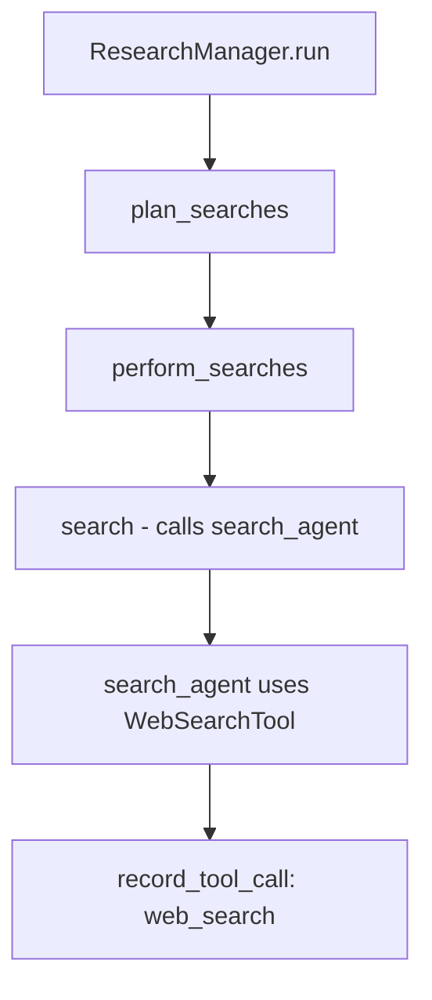
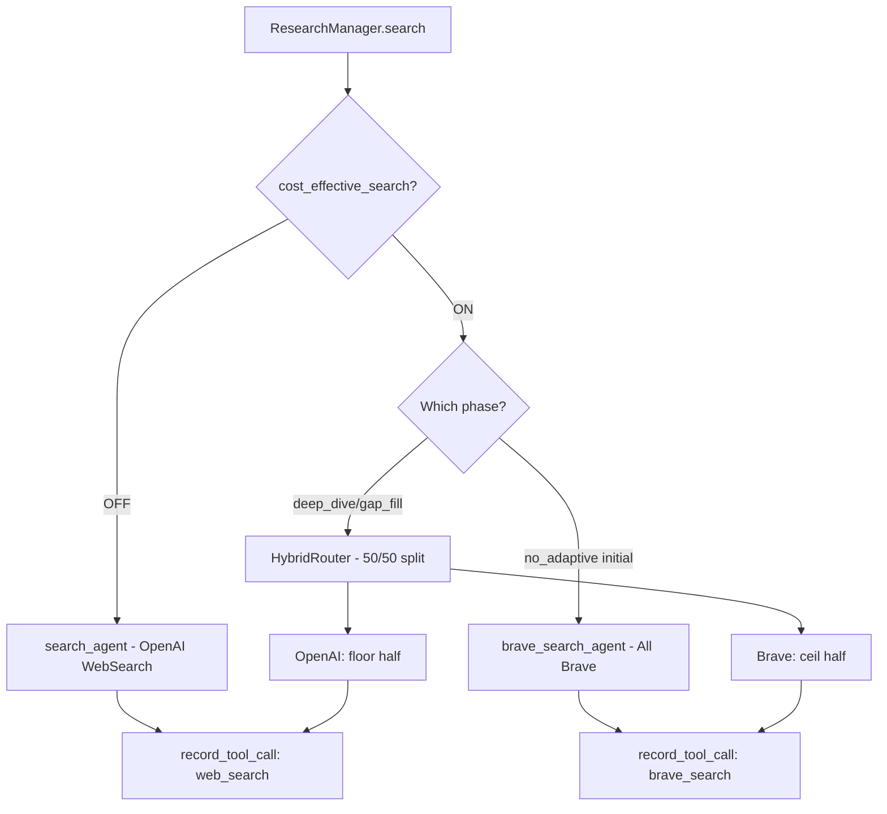
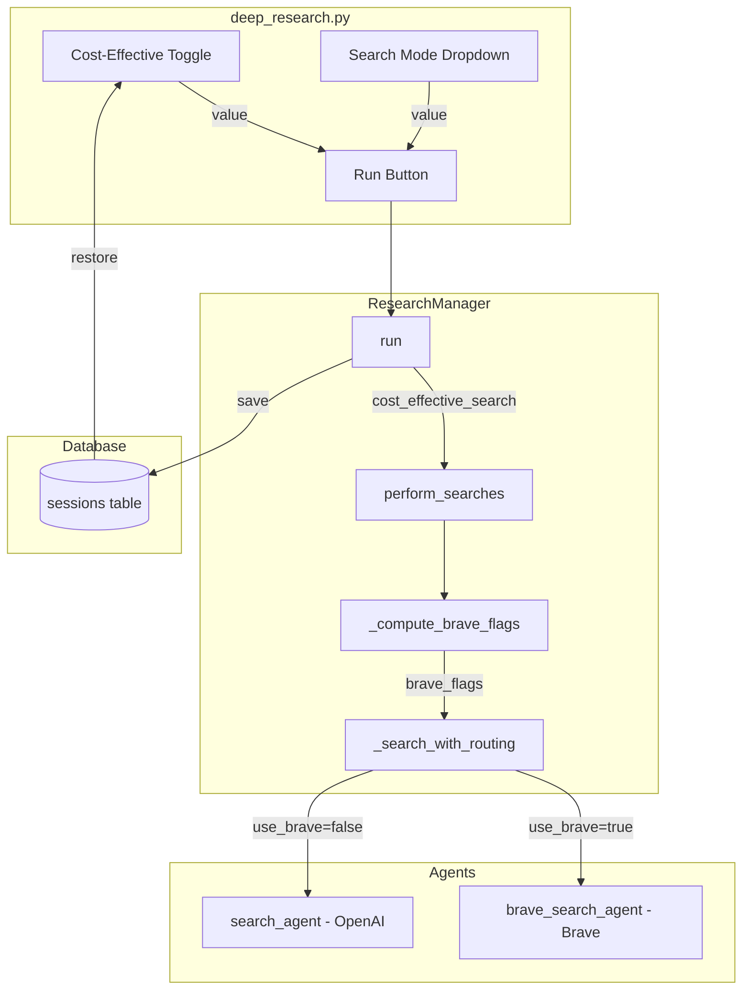

# Cost-Effective Search Implementation Plan (Steps 3-6)

## Summary of Completed Work (Steps 1-2)

### Step 1: Configuration ✅

- [`BRAVE_RATE_LIMIT_SECONDS`](config.py:65) set to `1.0`
- [`BRAVE_SEARCH_COST`](config.py:66) set to `0.0`
- [`TOOL_COSTS`](config.py:68) extended with `brave_search`

### Step 2: Brave Search Tool ✅

- [`brave_search_tool.py`](brave_search_tool.py:1) created with:
  - Rate limiting via [`_enforce_brave_rate_limit()`](brave_search_tool.py:22)
  - API call via [`_fetch_brave_results()`](brave_search_tool.py:44)
  - Result formatting via [`_format_brave_results()`](brave_search_tool.py:32)
  - Tool call recording via [`record_tool_call()`](brave_search_tool.py:84)
- [`brave_search_agent.py`](brave_search_agent.py:1) created as an Agent wrapper

---

## Step 3: Hybrid Search Routing

### Current Flow Analysis

The search flow currently works as follows:



The key method is [`ResearchManager.search()`](research_manager.py:746) which always uses the OpenAI `search_agent`.

### Proposed Architecture

Create a new routing layer that selects between OpenAI WebSearch and Brave Search based on:

1. The `cost_effective_search` toggle (new UI control)
2. The current search mode and phase



### Implementation Tasks

#### 3.1 Add `cost_effective_search` flag to ResearchManager

**File:** [`research_manager.py`](research_manager.py)

```python
# In __init__
self.cost_effective_search: bool = False

# In reset_session_state
self.cost_effective_search = False
```

#### 3.2 Modify `ResearchManager.run()` signature

**File:** [`research_manager.py`](research_manager.py:423)

```python
async def run(
    self,
    query: str,
    search_mode: str = SEARCH_MODE_DEFAULT,
    cost_effective_search: bool = False,
):
    # Store the flag
    self.cost_effective_search = cost_effective_search
    # ... rest of method
```

#### 3.3 Create hybrid search method

**File:** [`research_manager.py`](research_manager.py)

Add a new private method to route searches:

```python
async def _search_with_routing(
    self,
    item: WebSearchItem,
    use_brave: bool,
) -> str | None:
    """Execute a search using either Brave or OpenAI based on use_brave flag."""
    input_text = f"Search term: {item.query}\nReason for searching: {item.reason}"
    
    if use_brave:
        from brave_search_agent import brave_search_agent
        try:
            result = await Runner.run(brave_search_agent, input_text)
            self.update_usage_stats("brave_search_agent", result.context_wrapper.usage)
            # Note: brave_search_tool already calls record_tool_call
            return str(result.final_output)
        except Exception:
            return None
    else:
        try:
            result = await Runner.run(search_agent, input_text)
            self.update_usage_stats("search_agent", result.context_wrapper.usage)
            record_tool_call("search_agent", "web_search")
            return str(result.final_output)
        except Exception:
            return None
```

#### 3.4 Modify `perform_searches()` to use routing

**File:** [`research_manager.py`](research_manager.py:725)

```python
async def perform_searches(
    self,
    search_plan: WebSearchPlan,
    phase: str = "initial",
) -> list[str]:
    """Perform searches with hybrid routing based on cost_effective_search flag."""
    print("Searching...")
    num_completed = 0
    searches = search_plan.searches
    
    # Determine which searches use Brave vs OpenAI
    brave_flags = self._compute_brave_flags(searches, phase)
    
    tasks = [
        asyncio.create_task(self._search_with_routing(item, use_brave))
        for item, use_brave in zip(searches, brave_flags)
    ]
    
    results = []
    for task in asyncio.as_completed(tasks):
        result = await task
        if result is not None:
            results.append(result)
        num_completed += 1
        print(f"Searching... {num_completed}/{len(tasks)} completed")
    
    print("Finished searching")
    print(f"Total cost: {self.calculate_total_cost()}")
    return results
```

#### 3.5 Implement routing logic

**File:** [`research_manager.py`](research_manager.py)

```python
def _compute_brave_flags(
    self,
    searches: list[WebSearchItem],
    phase: str,
) -> list[bool]:
    """Determine which searches should use Brave vs OpenAI.
    
    Rules:
    - If cost_effective_search is OFF: all OpenAI (all False)
    - If cost_effective_search is ON:
      - phase=initial with no_adaptive mode: all Brave (all True)
      - phase=deep_dive or gap_fill: 50/50 split (ceil Brave, floor OpenAI)
    """
    n = len(searches)
    
    if not self.cost_effective_search:
        return [False] * n
    
    # For no_adaptive mode initial phase, use all Brave
    if phase == "initial" and self.search_mode == "no_adaptive":
        return [True] * n
    
    # For adaptive phases (deep_dive, gap_fill), use 50/50 split
    if phase in ("deep_dive", "gap_fill"):
        import math
        num_brave = math.ceil(n / 2)
        return [True] * num_brave + [False] * (n - num_brave)
    
    # Default: use Brave for cost-effective mode initial phase
    return [True] * n
```

#### 3.6 Update adaptive search execution

**File:** [`research_manager.py`](research_manager.py:147)

Modify [`_run_adaptive_searches()`](research_manager.py:147) to pass the phase name:

```python
async def _run_adaptive_searches(
    self, plan: AdaptiveSearchPlan | None
) -> list[str]:
    if plan is None:
        return []
    remaining_budget = plan.remaining_budget
    additional_results: list[str] = []
    for phase in plan.phases:
        if remaining_budget <= 0:
            break
        phase_searches = phase.searches[:remaining_budget]
        if not phase_searches:
            continue
        phase_plan = WebSearchPlan(searches=phase_searches)
        # Pass the phase name for hybrid routing
        phase_results = await self.perform_searches(phase_plan, phase=phase.phase)
        additional_results.extend(phase_results)
        remaining_budget -= len(phase_searches)
    return additional_results
```

#### 3.7 Update call sites

Update the main [`run()`](research_manager.py:423) method to pass `phase="initial"` to the first `perform_searches()` call:

```python
search_results = await self.perform_searches(search_plan, phase="initial")
```

#### 3.8 Add brave_search_agent to AGENT_MODEL_MAP

**File:** [`config.py`](config.py:39)

```python
AGENT_MODEL_MAP = {
    # ... existing entries ...
    "brave_search_agent": SEARCH_MODEL,
}
```

---

## Step 4: UI + Session State

### Current UI Analysis

The UI in [`deep_research.py`](deep_research.py) has:

- A search mode dropdown at line 104-110
- Session persistence via the database

### Implementation Tasks

#### 4.1 Add Cost-Effective Search toggle

**File:** [`deep_research.py`](deep_research.py)

Add a checkbox next to the search mode dropdown:

```python
# After search_mode dropdown (line 110)
cost_effective_toggle = gr.Checkbox(
    label="Cost-Effective Search (uses Brave)",
    value=False,
)
```

#### 4.2 Update run function signature

**File:** [`deep_research.py`](deep_research.py:12)

```python
async def run(query: str, search_mode: str, cost_effective: bool):
    async for chunk in research_manager.run(query, search_mode, cost_effective):
        yield chunk, research_manager.get_cost_summary(), []
```

#### 4.3 Update button click handlers

**File:** [`deep_research.py`](deep_research.py:121)

```python
run_button.click(
    fn=run,
    inputs=[query_textbox, search_mode, cost_effective_toggle],
    outputs=[report, cost_summary, chatbot],
)
query_textbox.submit(
    fn=run,
    inputs=[query_textbox, search_mode, cost_effective_toggle],
    outputs=[report, cost_summary, chatbot],
)
```

#### 4.4 Persist toggle in database

**File:** [`db.py`](db.py)

Add migration for the new column:

```python
await connection.execute(
    """
    ALTER TABLE sessions
    ADD COLUMN IF NOT EXISTS cost_effective_search BOOLEAN NOT NULL DEFAULT FALSE;
    """
)
```

#### 4.5 Update session creation

**File:** [`research_manager.py`](research_manager.py:228)

Modify [`_create_session()`](research_manager.py:228) to include the new flag:

```python
async def _create_session(
    self,
    initial_prompt: str,
    search_mode: str,
    cost_effective_search: bool = False,
) -> None:
    # ... existing code ...
    await connection.execute(
        """
        INSERT INTO sessions (
            id,
            header,
            initial_prompt,
            report_markdown,
            search_mode,
            cost_effective_search,
            usage_jsonb,
            cost_summary_jsonb
        ) VALUES ($1, $2, $3, $4, $5, $6, $7, $8)
        """,
        session_id,
        None,
        initial_prompt,
        None,
        search_mode,
        cost_effective_search,
        json.dumps(usage_snapshot),
        json.dumps(cost_snapshot),
    )
```

#### 4.6 Update session loading

**File:** [`research_manager.py`](research_manager.py:312)

Modify [`load_session()`](research_manager.py:312) to return and restore the flag:

```python
async def load_session(
    self, session_id: str
) -> tuple[str, str, list[dict[str, str]], str, str, bool]:
    # ... existing query ...
    session_row = await connection.fetchrow(
        """
        SELECT id,
               header,
               initial_prompt,
               report_markdown,
               search_mode,
               cost_effective_search,
               usage_jsonb,
               cost_summary_jsonb
        FROM sessions
        WHERE id = $1
        """,
        session_uuid,
    )
    # ... existing code ...
    self.cost_effective_search = session_row.get("cost_effective_search", False)
    # Return the flag as the 6th element
    return (
        report_markdown,
        cost_summary,
        history,
        self.last_query or "",
        self.search_mode,
        self.cost_effective_search,
    )
```

#### 4.7 Update UI load_session handler

**File:** [`deep_research.py`](deep_research.py:68)

```python
async def load_session(session_id: str):
    if not session_id:
        return "", "", [], "", SEARCH_MODE_DEFAULT, False, None
    (
        report_markdown,
        cost_text,
        history,
        initial_prompt,
        search_mode,
        cost_effective,
    ) = await research_manager.load_session(session_id)
    return (
        report_markdown,
        cost_text,
        history,
        initial_prompt,
        search_mode,
        cost_effective,
        session_id,
    )
```

Update the `session_radio.change` handler outputs:

```python
session_radio.change(
    fn=load_session,
    inputs=session_radio,
    outputs=[
        report,
        cost_summary,
        chatbot,
        query_textbox,
        search_mode,
        cost_effective_toggle,  # Add this
        session_state,
    ],
)
```

#### 4.8 Update new_session handler

**File:** [`deep_research.py`](deep_research.py:81)

```python
def new_session():
    research_manager.reset_session_state()
    return "", "", [], "", SEARCH_MODE_DEFAULT, False, None, gr.update(value=None)
```

Update outputs:

```python
new_session_button.click(
    fn=new_session,
    inputs=None,
    outputs=[
        report,
        cost_summary,
        chatbot,
        query_textbox,
        search_mode,
        cost_effective_toggle,  # Add this
        session_state,
        session_radio,
    ],
)
```

---

## Step 5: Cost Tracking

### Current Implementation Analysis

Cost tracking is already partially implemented:

- [`record_tool_call()`](usage_tracker.py:31) records tool calls into [`SessionUsage`](new_models.py:21)
- [`brave_search_tool.py`](brave_search_tool.py:84) calls `record_tool_call("brave_search_agent", "brave_search")`
- [`TOOL_COSTS`](config.py:68) includes `brave_search` with configurable cost

### Verification Tasks

#### 5.1 Verify cost calculation includes Brave

**File:** [`research_manager.py`](research_manager.py:610)

The [`calculate_total_cost()`](research_manager.py:610) method already iterates over all tool calls:

```python
for tool_name, count in self.session_usage.total_tool_calls.items():
    total_cost += TOOL_COSTS.get(tool_name, 0.0) * count
```

This will automatically include `brave_search` costs when they are recorded.

#### 5.2 Add brave_search_agent usage tracking

**File:** [`research_manager.py`](research_manager.py)

The new [`_search_with_routing()`](research_manager.py) method needs to call `update_usage_stats()` for `brave_search_agent`. This is included in the implementation above.

#### 5.3 Ensure consistent agent naming

The brave_search_tool records tool calls as `"brave_search_agent"` while the tool itself records as `"brave_search"`. This is correct:

- Agent name: `"brave_search_agent"` - for LLM token tracking
- Tool name: `"brave_search"` - for per-call cost tracking

---

## Step 6: Validation

### Manual Smoke Tests

#### Test Case 1: Cost-Effective OFF

1. Set toggle OFF
2. Run a simple research query
3. Verify:
   - All searches use `web_search` tool
   - Cost summary shows only `web_search` tool calls
   - No `brave_search` entries in usage

#### Test Case 2: Cost-Effective ON with no_adaptive

1. Set toggle ON
2. Set search mode to `no_adaptive`
3. Run a simple research query
4. Verify:
   - All searches use `brave_search` tool
   - Cost summary shows only `brave_search` tool calls
   - No `web_search` entries in usage

#### Test Case 3: Cost-Effective ON with deep_dive

1. Set toggle ON
2. Set search mode to `deep_dive`
3. Run a query that triggers adaptive searches
4. Verify:
   - Initial searches use Brave
   - Adaptive phase shows roughly 50/50 split
   - Both `brave_search` and `web_search` in usage

#### Test Case 4: Session Persistence

1. Run a research with cost-effective ON
2. Refresh the page
3. Load the session
4. Verify the cost-effective toggle is restored to ON

### Validation Script (Optional)

Create a test script `test_hybrid_search.py`:

```python
import asyncio
from research_manager import ResearchManager

async def test_search_routing():
    rm = ResearchManager()
    
    # Test 1: cost_effective=False
    rm.cost_effective_search = False
    rm.search_mode = "no_adaptive"
    from new_models import WebSearchItem
    items = [WebSearchItem(query="test", reason="test")]
    flags = rm._compute_brave_flags(items, "initial")
    assert flags == [False], f"Expected [False], got {flags}"
    
    # Test 2: cost_effective=True, no_adaptive
    rm.cost_effective_search = True
    rm.search_mode = "no_adaptive"
    flags = rm._compute_brave_flags(items, "initial")
    assert flags == [True], f"Expected [True], got {flags}"
    
    # Test 3: cost_effective=True, deep_dive phase
    rm.search_mode = "deep_dive"
    items = [WebSearchItem(query=f"test{i}", reason="test") for i in range(5)]
    flags = rm._compute_brave_flags(items, "deep_dive")
    # ceil(5/2) = 3 Brave, floor(5/2) = 2 OpenAI
    assert flags == [True, True, True, False, False], f"Expected 3T+2F, got {flags}"
    
    print("All routing tests passed!")

if __name__ == "__main__":
    asyncio.run(test_search_routing())
```

---

## Implementation Checklist

### Step 3: Hybrid Search Routing

- [ ] Add `cost_effective_search` to `ResearchManager.__init__`
- [ ] Add `cost_effective_search` to `reset_session_state`
- [ ] Update `run()` signature to accept `cost_effective_search`
- [ ] Create `_search_with_routing()` method
- [ ] Create `_compute_brave_flags()` method
- [ ] Update `perform_searches()` to accept phase parameter
- [ ] Update `_run_adaptive_searches()` to pass phase name
- [ ] Add `brave_search_agent` to `AGENT_MODEL_MAP`

### Step 4: UI + Session State

- [ ] Add cost-effective toggle checkbox to UI
- [ ] Update `run()` function to pass toggle value
- [ ] Update button click handlers for new input
- [ ] Add `cost_effective_search` column to sessions table
- [ ] Update `_create_session()` to save toggle value
- [ ] Update `_update_session()` to save toggle value
- [ ] Update `load_session()` to return toggle value
- [ ] Update UI `load_session` handler for new output
- [ ] Update `new_session()` to reset toggle

### Step 5: Cost Tracking

- [ ] Verify `calculate_total_cost()` includes brave_search
- [ ] Verify brave_search_agent usage tracking works
- [ ] Test cost summary display with mixed tools

### Step 6: Validation

- [ ] Manual test: cost-effective OFF
- [ ] Manual test: cost-effective ON with no_adaptive
- [ ] Manual test: cost-effective ON with deep_dive
- [ ] Manual test: session persistence
- [ ] Optional: create automated test script

---

## Architecture Diagram


